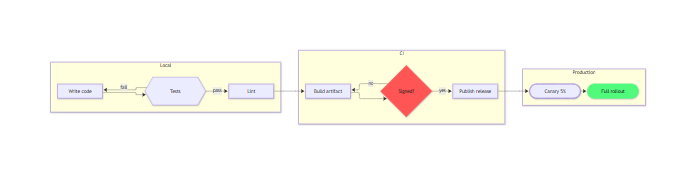
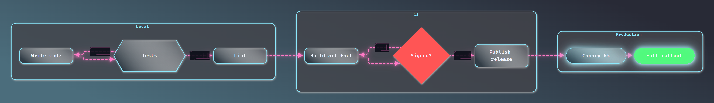
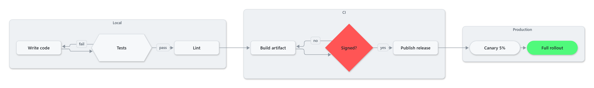
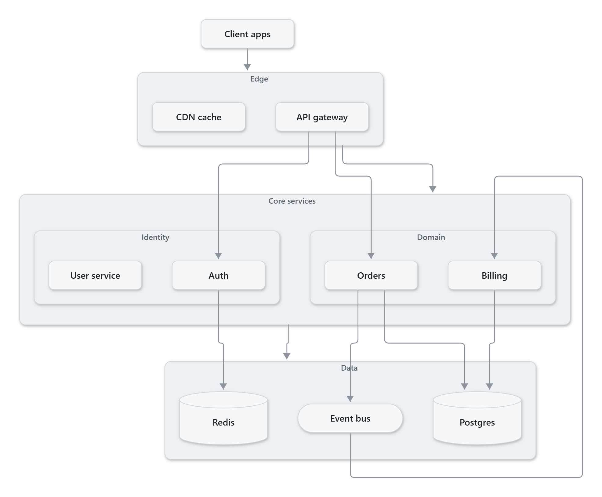
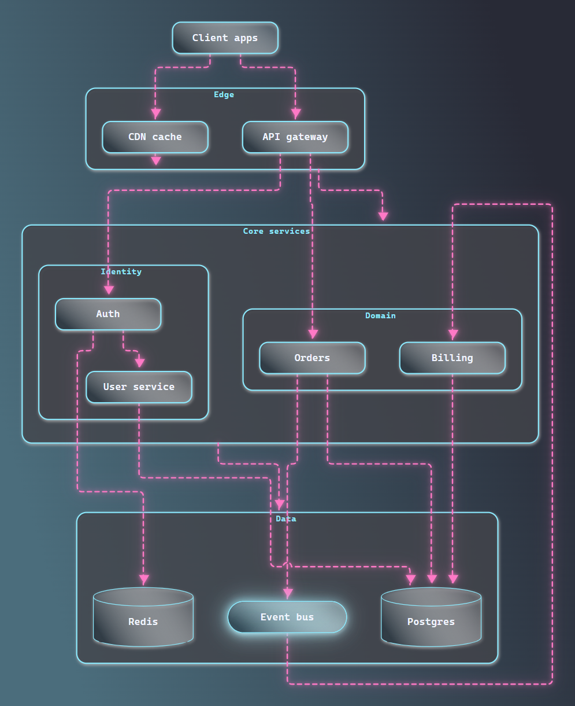
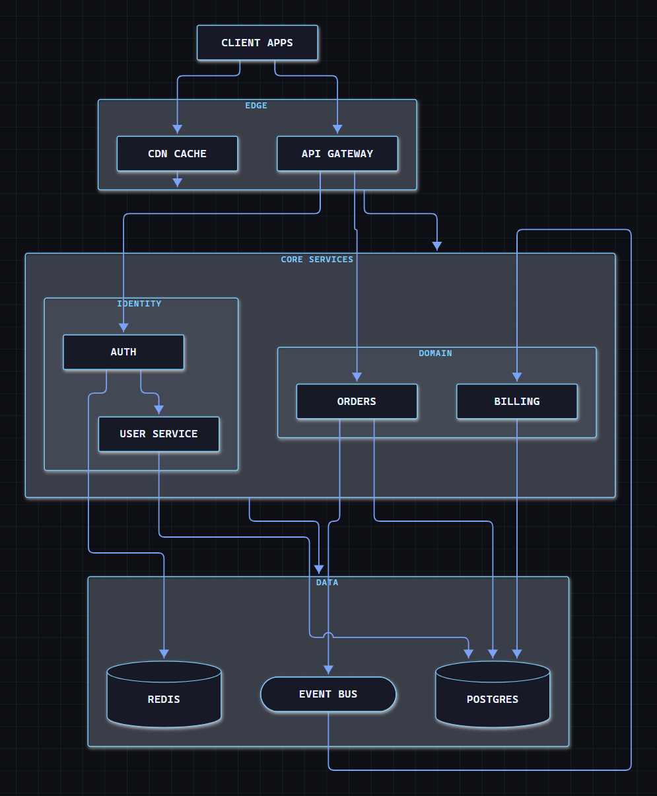
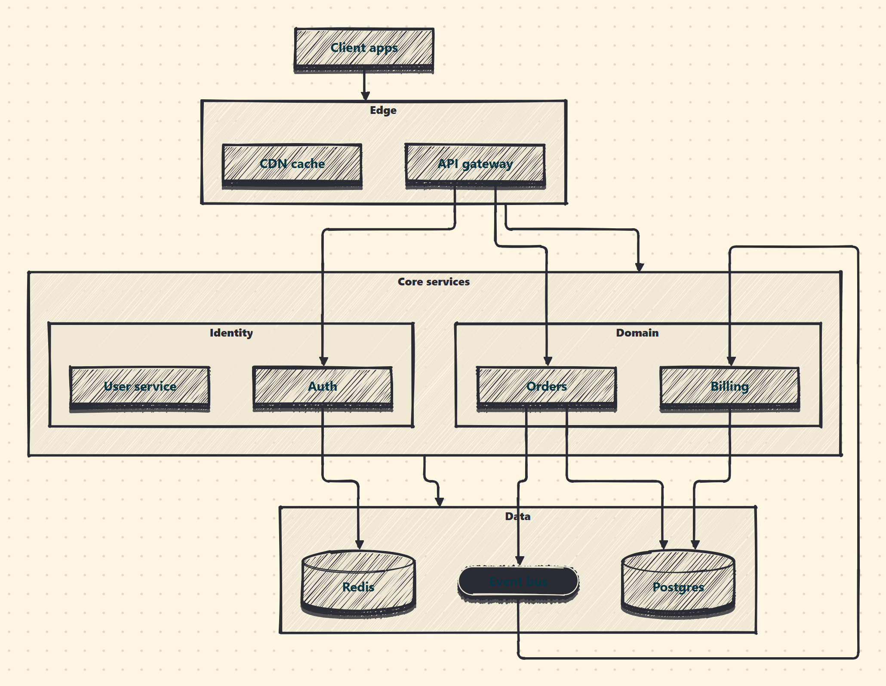
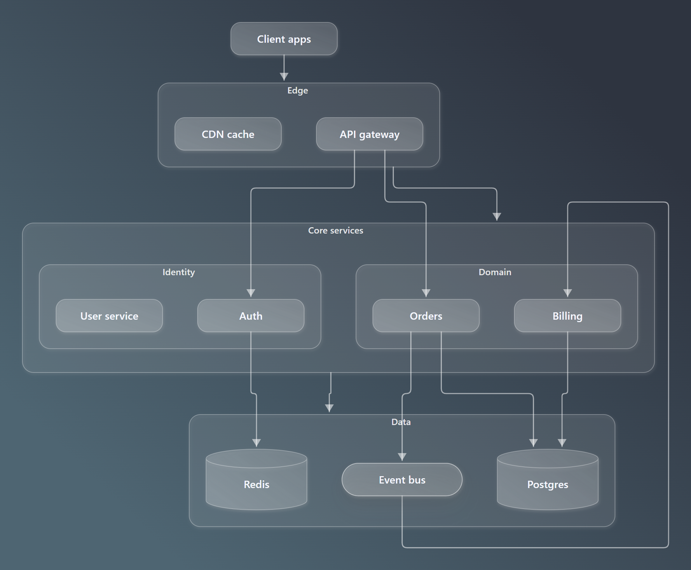
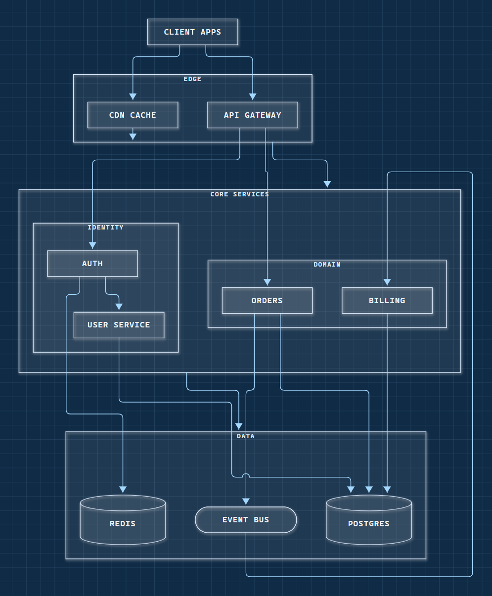

<div align="center">

# NeoMermaid

**Mermaid, dressed for 2026.**
Same syntax. Completely different look. One engine behind a VS Code preview, a CLI and a browser playground.

[](https://github.com/Weidows/neomermaid/actions/workflows/ci.yml)
[](./LICENSE)


[](https://blog.weidows.tech/neomermaid/)

</div>

---

## Before / after

The "before" is mermaid's own stock `default` theme, rendered by mermaid itself — not a strawman.

<table>
<tr><th>Stock mermaid</th><th>NeoMermaid <code>neon/dracula</code></th></tr>
<tr>
<td></td>
<td></td>
</tr>
</table>

<picture>
  <source media="(prefers-color-scheme: dark)" srcset="./docs/images/hero-dark.png">
  
</picture>

## Six themes × eleven palettes = 66 looks

| | | |
|---|---|---|
|  **minimal** — document-grade calm |  **neon** — glow, dashes, near-black canvas |  **tech** — schematic grid, monospace, sharp |
|  **cartoon** — hand-drawn marker doodle |  **glass** — frosted panels on a gradient |  **blueprint** — cyanotype drafting table |

Palettes: `dracula` · `one-dark-pro` · `nord` · `gruvbox-dark` · `catppuccin-mocha` · `tokyo-night` · `monokai` · `rose-pine` · `github-light` · `solarized-light` · `nord-light`

## Three entry points, one renderer

| Surface | Command / install | What it is for |
|---|---|---|
| **VS Code extension** | `code --install-extension neomermaid-vscode-0.1.0.vsix` | Live preview beside your `.mmd` file, theme picker in the toolbar, export to PNG/SVG |
| **CLI** | `npx @neomermaid/cli render flow.mmd -o flow.png --preset neon/dracula` | Scripts, CI and **agents** — JSON in, beautiful images out |
| **Live demo** | [blog.weidows.tech/neomermaid](https://blog.weidows.tech/neomermaid/) | No install: edit, switch themes, export |

Plus the SDK itself, for your own product:

```bash
npm install @neomermaid/core
```

```ts
import { render } from '@neomermaid/core';

const { svg, width, height } = await render(`
  flowchart LR
    A[Write code] --> B{OK?}
    B -- yes --> C[Ship]
    B -- no  --> D[Fix]
`, { preset: 'neon/dracula', padding: 24 });

document.body.innerHTML = svg;
```

## What you can change

Everything visual is a token. Themes and palettes are just presets over these:

```ts
await render(source, {
  theme: 'tech',
  palette: 'tokyo-night',
  background: 'transparent',   // or 'theme', or any CSS colour
  padding: 24,
  styling: {
    geometry:   { nodeRadius: 2, strokeWidth: 1.5, edgeWidth: 2, edgeDash: '6 4',
                  arrowScale: 1.2, clusterRadius: 4, nodeShadow: 8, nodeShadowY: 3, edgeGlow: 5 },
    typography: { fontFamily: 'JetBrains Mono, monospace', fontSize: 14, fontWeight: 600,
                  letterSpacing: 0.4, textTransform: 'uppercase', labelFontSize: 12 },
    effects:    { nodeFill: 'gradient', gradientAngle: 150, background: 'grid',
                  patternColor: 'rgba(94,234,212,0.12)', patternSize: 28,
                  animatedEdges: true, sketch: false },
    colors:     { nodeFill: '#111a2b', nodeStroke: '#5eead4', edge: '#7aa2f7',
                  edgeLabelBg: '#0f172a', accent: '#5eead4' /* … */ },
  },
});
```

Define your own theme in ~20 lines — a theme is a pure function of a palette:

```ts
import { defineTheme, type Palette } from '@neomermaid/core';

export const brutalist = defineTheme({
  id: 'brutalist',
  name: 'Brutalist',
  description: 'Hard black borders, offset blocks, zero mercy.',
  appearance: 'light',
  derive: (p: Palette) => ({
    colors: {
      bg: '#f4f4f0',
      nodeFill: '#ffffff',
      nodeFillAlt: '#f0f0ea',
      nodeStroke: '#000000',
      nodeText: '#000000',
      edge: '#000000',
      edgeLabelBg: '#ffe066',
      edgeLabelText: '#000000',
      clusterFill: 'rgba(0,0,0,0.04)',
      clusterStroke: '#000000',
      clusterText: '#000000',
      accent: p.hues.orange,
    },
    geometry: {
      nodeRadius: 0, strokeWidth: 3, edgeWidth: 3, edgeDash: null,
      arrowScale: 1.3, clusterRadius: 0, nodeShadow: 0, nodeShadowY: 6, edgeGlow: 0,
    },
    typography: {
      fontFamily: 'Inter, Segoe UI, sans-serif', fontSize: 15, fontWeight: 800,
      letterSpacing: -0.2, textTransform: 'uppercase', labelFontSize: 13, titleWeight: 800,
    },
    effects: {
      nodeFill: 'flat', gradientAngle: 180, background: 'solid',
      patternColor: '#000', patternSize: 24, animatedEdges: false, sketch: false,
    },
  }),
});

await render(source, { theme: brutalist, palette: 'solarized-light' });
```

Full token reference: [docs/theming.md](./docs/theming.md).

## CLI

```bash
neomermaid render flow.mmd -o flow.png --preset neon/dracula     # 2× PNG
neomermaid render flow.mmd -o flow.svg --theme tech              # vector
cat flow.mmd | neomermaid render - --preset glass/nord --json    # agent friendly
neomermaid render flow.mmd -o flow.png --curve linear --stroke-width 3 --font-size 18
neomermaid gallery examples -o .gallery                          # render a whole folder
neomermaid themes --json                                         # discover themes/palettes/presets
neomermaid doctor                                                # which browser, which bundle
```

`--json` gives a stable contract for automation:

```json
{
  "ok": true,
  "format": "png",
  "theme": "neon", "palette": "dracula", "preset": "neon/dracula",
  "width": 658, "height": 209, "scale": 2,
  "out": "/abs/path/flow.png", "bytes": 187616, "warnings": []
}
```

Errors return `{"ok": false, "error": "…"}` with a non-zero exit code, so an agent can branch on it.
Run `neomermaid help` for every flag ([full reference](./docs/cli.md)).

## VS Code

Open a `.mmd` / `.mermaid` file and hit <kbd>Ctrl/Cmd</kbd>+<kbd>Shift</kbd>+<kbd>M</kbd>:

- live preview that updates as you type, in either editor column
- theme **and** palette pickers right in the preview toolbar
- **Export as PNG / SVG**, **Copy SVG**
- follows your VS Code light/dark theme automatically (`neomermaid.followEditorTheme`)
- `neomermaid.defaultPreset`, `neomermaid.background`, `neomermaid.padding`, `neomermaid.exportScale` in settings

See [docs/vscode.md](./docs/vscode.md).

## How it works

NeoMermaid does **not** reimplement mermaid's parser or layout — that would break compatibility. It owns the layer after it:

```
your .mmd ──► mermaid 12 (parse + layout + raw SVG)  ──►  NeoMermaid style layer  ──►  SVG / PNG / PDF
                 unchanged syntax                          themes · palettes · tokens
```

The style layer is a generated stylesheet plus targeted SVG surgery: canvas and background patterns, gradients, CSS drop-shadows, corner radii, arrow scaling, and per-path treatment of hand-drawn shapes. Rendering happens in a real browser engine, because mermaid measures every label through real font metrics — which is exactly why the CLI, the extension and the demo produce identical output.

Handling mermaid's real-world quirks is most of the work:

- mermaid 12 seeds every edge with an inline draw-in `stroke-dasharray`, which beats CSS — NeoMermaid strips it so theme dashes and motion apply, while leaving `@{ animation: … }` edges alone
- edge labels are measured with mermaid's font; NeoMermaid re-measures with yours and grows the `foreignObject`, or the text would be invisible
- SVG filter regions are derived from the bounding box, and a horizontal edge has zero height — so glows are CSS drop-shadows, never `filter: url(#…)`
- `look: handDrawn` emits a dense hatch path that acts as the fill; painting it like an outline turns nodes into black blobs

## Compatibility & security

- **Syntax:** standard mermaid, unchanged. Flowcharts (subgraphs, classDef), sequence, state, class, ER, gantt, pie, mindmap, journey are first-class; other families inherit the palette.
- **Runtime:** Node ≥ 20 for the CLI; any Chromium-based browser (Chrome, Edge, Brave, Chromium, or a cached Playwright/Puppeteer build) already installed — nothing is downloaded.
- **Security:** like the official preview, the renderer defaults to mermaid's `securityLevel: 'loose'` so `classDef` styles and rich labels work. Pass `--security strict` (CLI) or `mermaid: { securityLevel: 'strict' }` (SDK) for untrusted input.

## Development

```bash
git clone https://github.com/Weidows/neomermaid && cd neomermaid
npm install
npm run build          # core (ESM + browser bundle) and CLI
npm test               # 44 unit tests
npm run examples       # regenerate examples/*.mmd from the SDK corpus
node scripts/render-docs.mjs   # regenerate the images in this README
```

```
packages/core     @neomermaid/core   theme engine · palettes · SVG style layer (browser)
packages/cli      @neomermaid/cli    headless-browser renderer, SVG/PNG/PDF, agent JSON
packages/vscode   neomermaid-vscode  preview webview, export, settings
apps/demo         live playground    Vite + TS, deployed to GitHub Pages
examples/         10 diagrams        one per diagram family & feature
```

MIT © [Weidows](https://github.com/Weidows)
